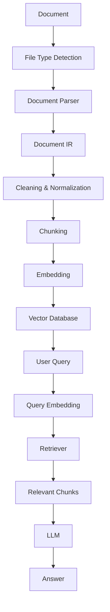

```mermaid
flowchart TD
    A[Document] --> B[File Type Detection]
    B --> C[Document Parser]
    C --> D[Document IR]
    D --> E[Cleaning & Normalization]
    E --> F[Chunking]
    F --> G[Embedding]
    G --> H[Vector Database]

    H --> I[User Query]
    I --> J[Query Embedding]
    J --> K[Retriever]
    K --> L[Relevant Chunks]
    L --> M[LLM]
    M --> N[Answer]


```